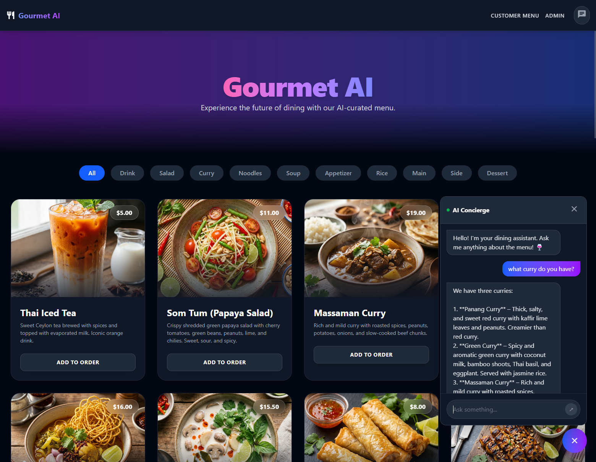
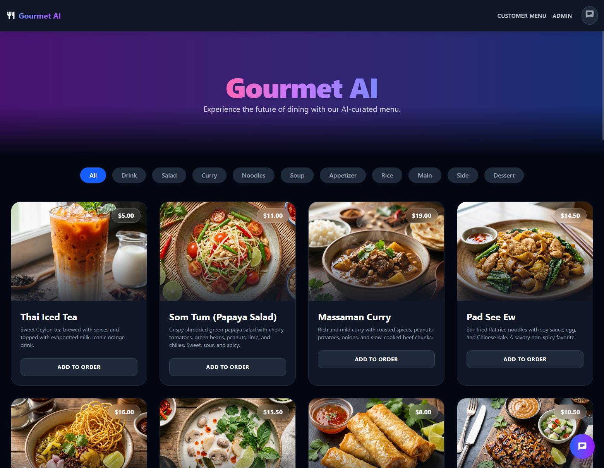
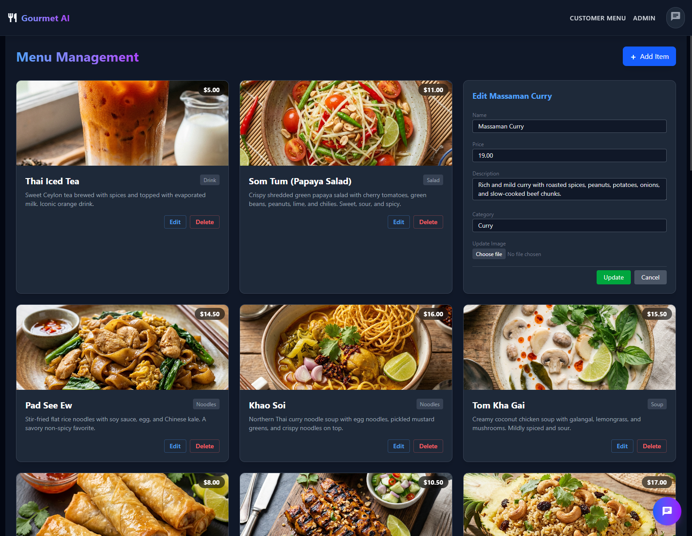

# SmartMenu AI 🍽️🤖

A proof of concept for next-generation digital menu system enabling customers to explore dishes and get personalized recommendations via an **AI-powered assistant**, while providing restaurant staff with a robust **Admin Dashboard** for real-time menu management.

<div align="center">
  <video src="ai-chat-demo.mp4" width="100%" controls autoplay loop muted></video>
</div>




## ✨ Features

### 🥗 Customer Interface
- **Visual Menu**: Browse a responsive, accessible grid of menu items with high-quality images and descriptions.
- **AI Concierge**: A floating chat widget powered by LLMs (via LM Studio/RAG) that answers questions like *"What's good for a gluten-free diet?"* or *"Is the Green Curry spicy?"*.
- **Smart Formatting**: Chat responses are beautifully formatted with markdown rendering.

### 👨‍🍳 Admin Dashboard (CMS)
- **Menu Management**: Add, update, and delete menu items instantly.
- **Image Handling**: Seamlessly link images to menu items.
- **Secure Editing**: Simple interface for managing prices, categories, and descriptions.

## 🛠️ Tech Stack

- **Frontend**: Angular v21 (Standalone Components, Signals, TailwindCSS)
- **Backend**: FastAPI (Python), SQLAlchemy, Pydantic
- **Database**: PostgreSQL with `pgvector` (for vector embeddings and AI search capability)
- **Containerization**: Docker & Docker Compose

## 🚀 Getting Started

### Prerequisites
- Docker & Docker Compose
- Node.js - v20.19.0 or newer for running Angular V21 [Angular](https://angular.dev/installation)
- LM Studio (running an OpenAI-compatible server at `http://localhost:1234`)

### Installation & Setup

1. **Clone the repository**
   ```bash
   git clone https://github.com/dumenu8/smart-menu-ai.git
   cd smart-menu-ai
   ```

2. **Run with Docker Compose:**
   ```bash
   # Start all services (Database, Backend)
   docker-compose up -d
   ```
   
3. **Setup the Database & Seed Menu:**
   ```bash
   # Enter the backend container or run locally to seed menu item embeddings
   cd backend
   python seed.py
   ```
   
4. **Run the Frontend:**
   ```bash
   cd frontend
   npm install
   npm start
   ```


## 📐 Architecture

Detailed system architecture, including data flows and component breakdowns, can be found in the [ARCHITECTURE.md](./ARCHITECTURE.md) file.

## 📸 Screenshots

### Customer Menu


### Admin Management


## 🤝 Contributing
Pull requests are welcome. For major changes, please open an issue first to discuss what you would like to change.

## 📄 License
[MIT](https://choosealicense.com/licenses/mit/)
